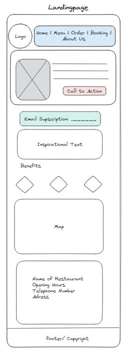
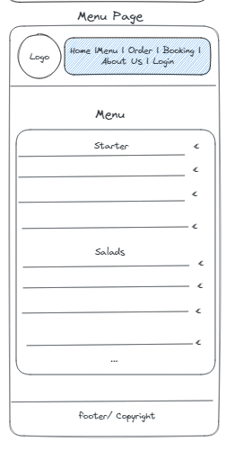
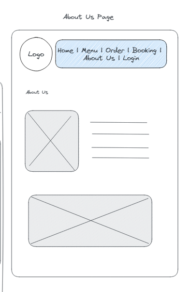

# MVP User Stories

---

## User Story 1: Basic Pages

## User Story 1.1: Landing Page

### Value Proposition

As an potential customer
I want to see a landingpage
So that I have the most important information of the restaurant

### Description

### Acceptance Criteria

- [ ] A Logo and a NavBar is shown at the top as a header component
- [ ] A cover Image is shown with a call to action Button (order page)
- [ ] I can subscribe to a Email Newsletter
- [ ] I see a summary of the benefits here
- [ ] I see Information like adress, name, opening hours, number

### Tasks

- [ ] create a logo and a color scheme
- [ ] build a navbar
- [ ] build a cover image with the button
- [ ] create database/connection for email marketing
- [ ] create api for email marketing
- [ ] show information, benefits, insp text and map
- [ ] create the footer with copyright

---

## User Story 1.2: Menu Page

### Value Proposition

as a potential customer
I want to see a menu page
so that I can decide beforehand what to order

### Description

### Acceptance Criteria

- [ ] list all items by categories
- [ ] categories should have a order

### Tasks

- [ ] create collections products
- [ ] create collections categories
- [ ] create some data for those
- [ ] api fetch call when on the menu page
- [ ] pass as props into menu component

---

## User Story 1.3: About Us Page

### Value Proposition

As a potential customer
I want to know about the restaurant/team
so I know what they value

### Description

### Acceptance Criteria

- [ ] pictures of the restaurant/team
- [ ] "why" answer

### Tasks

- [ ] create an inspirational text
- [ ] include some close team picture
